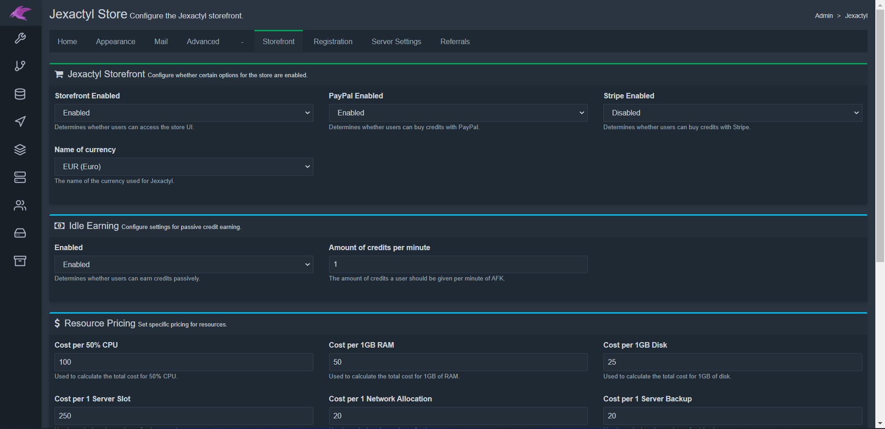
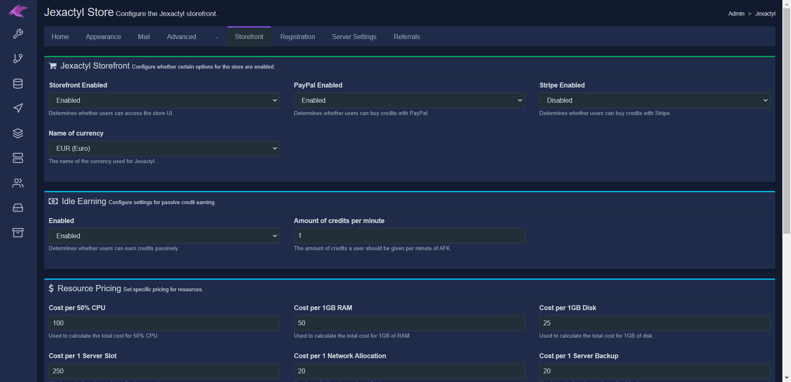

# Welcome to Jexactyl!

Jexactyl is a modern, fast and feature-rich fork of [Pterodactyl Panel](https://github.com/pterodactyl/panel).
Jexactyl aims to improve already-existing features of this software as well as integrate many more functions
to make this software easier more advanced while also being nicer to use.

## Features
- Built using the latest dependencies and packages
- Allows users to purchase resources and create servers
- Clean, minimalistic UI
- Fully configurable
- Server Renewal system

## Ready to get started?
If you're a new user, you should check out our [Installation Guides](https://docs.jexactyl.com/#/latest/panel/install/dependencies).

If you're a more experienced user who wants to edit the Panel, check out our [Modification Guides](https://docs.jexactyl.com/#/latest/build/install).

## Screenshots

